# Backyard Blooms (Python-Flask-SQL App/MariaDB)

## Overview
#### With over 100 different plants, a backyard gardener must balance an assortment of diverse needs when considering how to plant and maintain their garden. Each plant will have a requirement for the amount of sun, water, and fertilizer needed, which will dictate which garden bed type it can be planted to. Additionally, plants have space requirements, which place a limitation on how much can be produced from a given bed. For example, in a 4 ft x 4 ft plot (GardenBeds), the gardener knows they will be able to fit 10 cherry tomato Plants. They know that these tomatoes thrive in the sun. This database will record assorted Plants by Species, as well as location via GardenBeds, requirements via Amendments, and output via Harvests.This all helps determine how much the gardener must grow to achieve a desired yield, as well as how much space they must allocate.

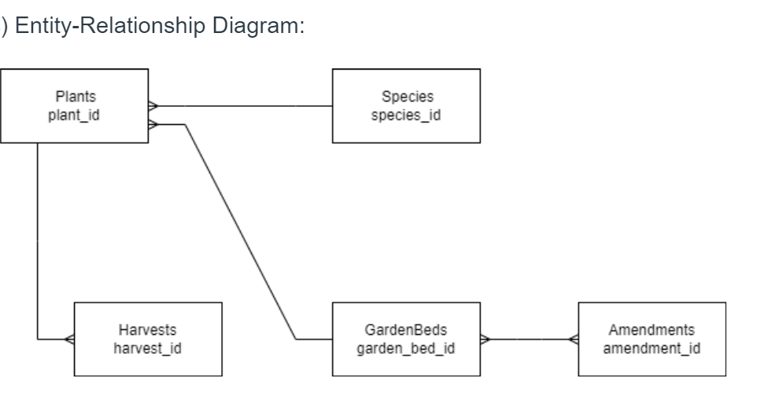

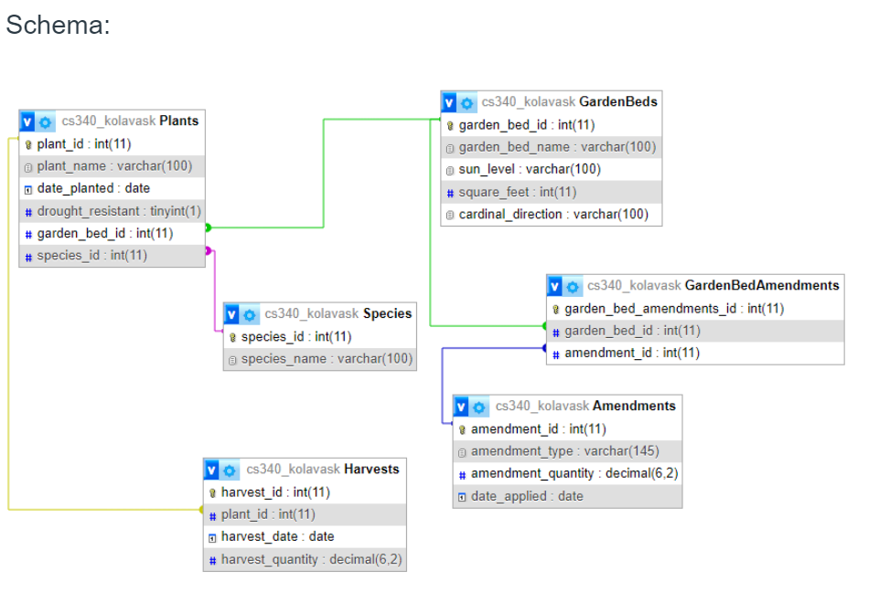

#### The following are screenshots of the Backyard Blooms application. Each Entity contains ADD/UPDATE/DELETE Functionality

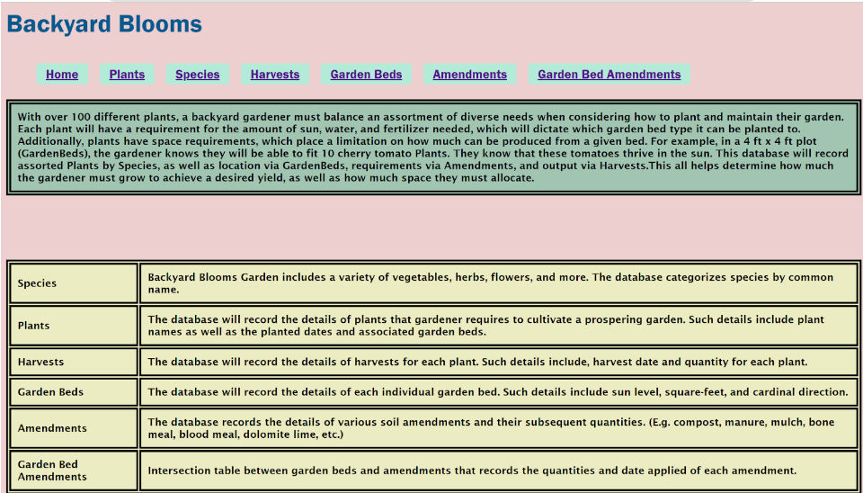
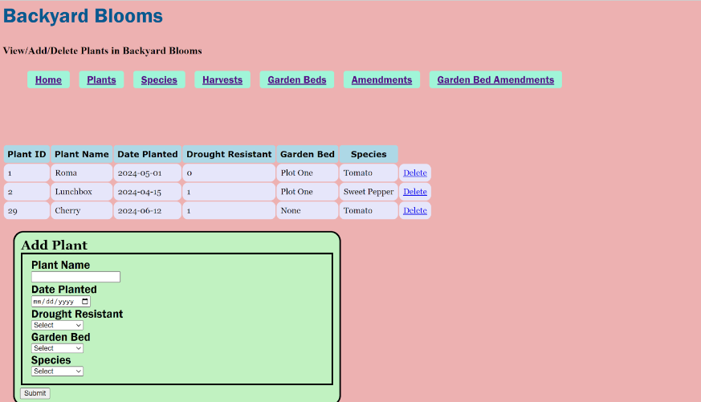
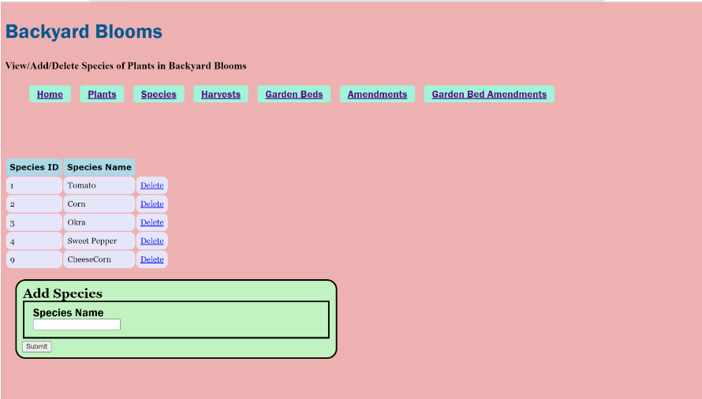
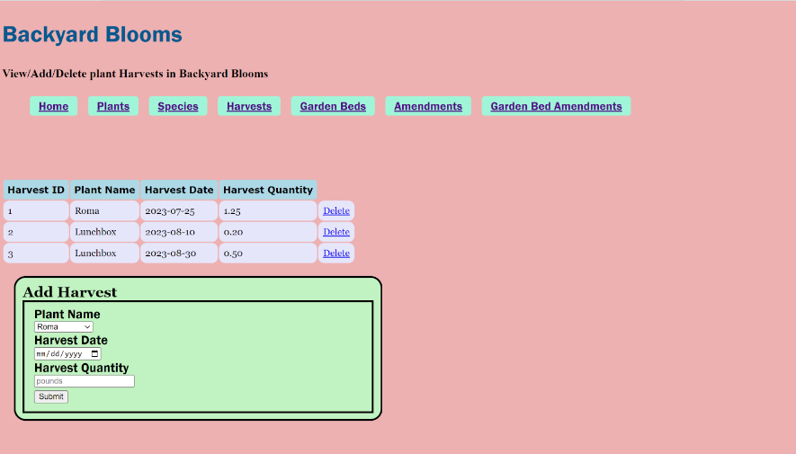
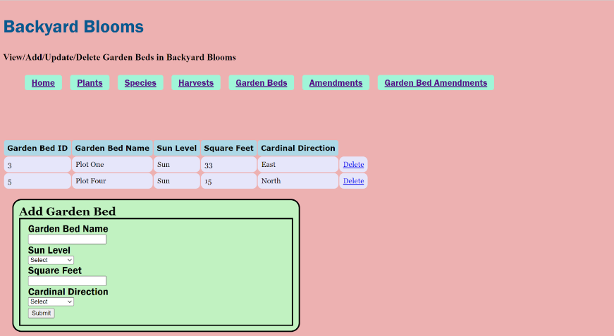
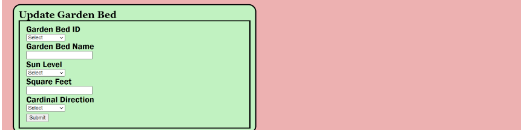
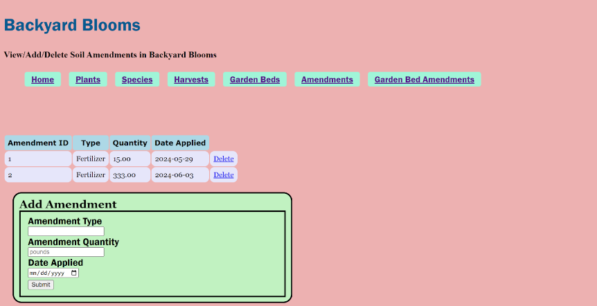
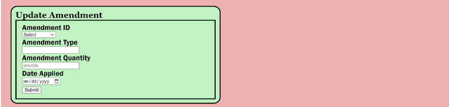
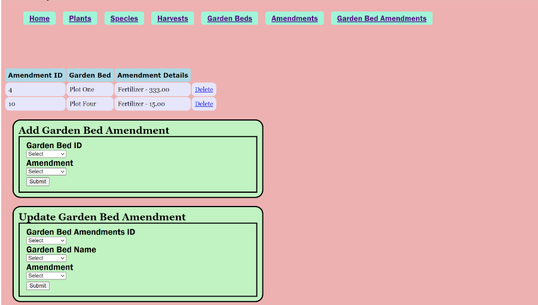
